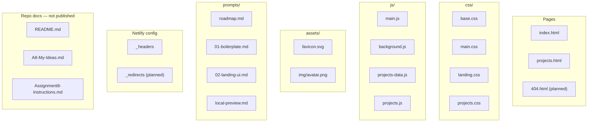
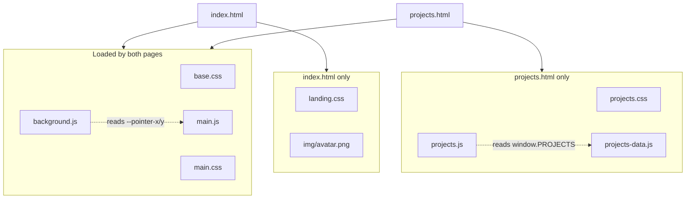

# Project Structure

## Directory layout

```mermaid
flowchart TD
    subgraph pages["Pages"]
        direction LR
        index["index.html"]
        projects["projects.html"]
        notfound["404.html (planned)"]
    end

    subgraph styles["css/"]
        direction LR
        base["base.css"]
        maincss["main.css"]
        landing["landing.css"]
        projectscss["projects.css"]
    end

    subgraph scripts["js/"]
        direction LR
        mainjs["main.js"]
        bgjs["background.js"]
        datajs["projects-data.js"]
        projjs["projects.js"]
    end

    subgraph media["assets/"]
        direction LR
        favicon["favicon.svg"]
        avatar["img/avatar.png"]
    end

    subgraph promptdir["prompts/"]
        direction LR
        roadmap["roadmap.md"]
        boiler["01-boilerplate.md"]
        landingp["02-landing-ui.md"]
        preview["local-preview.md"]
    end

    subgraph netlify["Netlify config"]
        direction LR
        headers["_headers"]
        redirects["_redirects (planned)"]
    end

    subgraph rootdocs["Repo docs — not published"]
        direction LR
        readme["README.md"]
        ideas["A8-My-Ideas.md"]
        instr["Assignment8-Instructions.md"]
    end
```

## What loads what

```mermaid
flowchart TD
    index["index.html"]
    projects["projects.html"]

    subgraph shared["Loaded by both pages"]
        direction LR
        base["base.css"]
        main["main.css"]
        mainjs["main.js"]
        bgjs["background.js"]
    end

    subgraph homeOnly["index.html only"]
        direction LR
        landing["landing.css"]
        avatar["img/avatar.png"]
    end

    subgraph projOnly["projects.html only"]
        direction LR
        projcss["projects.css"]
        datajs["projects-data.js"]
        projjs["projects.js"]
    end

    index --> shared
    index --> homeOnly
    projects --> shared
    projects --> projOnly

    projjs -.->|reads window.PROJECTS| datajs
    bgjs -.->|reads --pointer-x/y| mainjs
```
